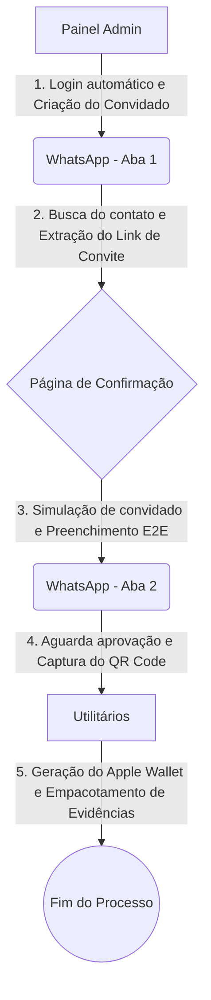
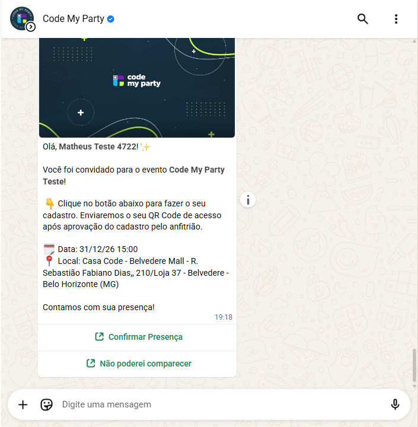
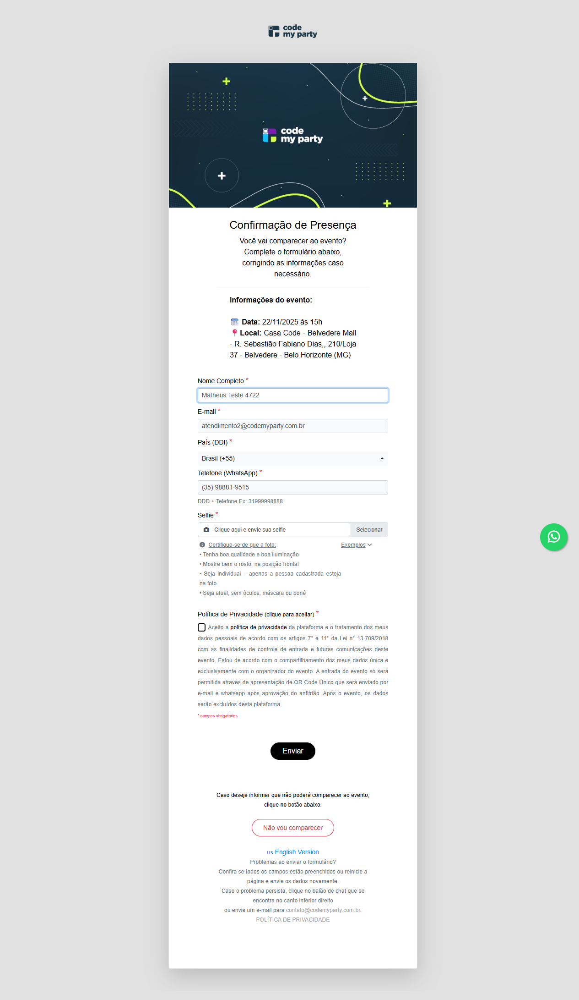
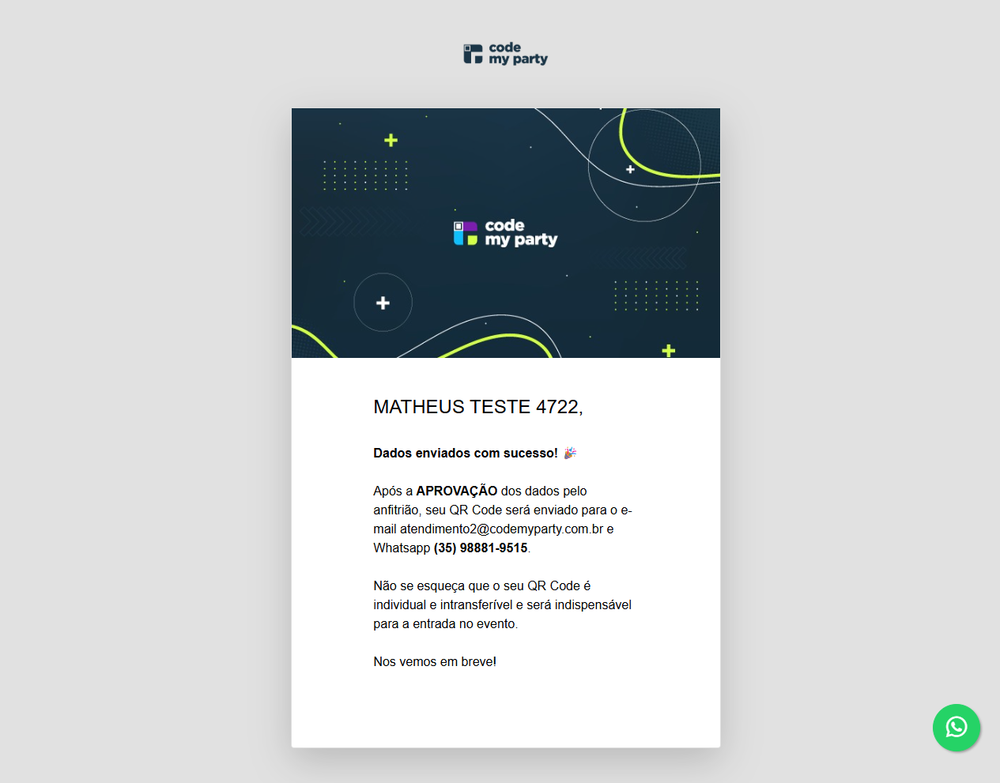
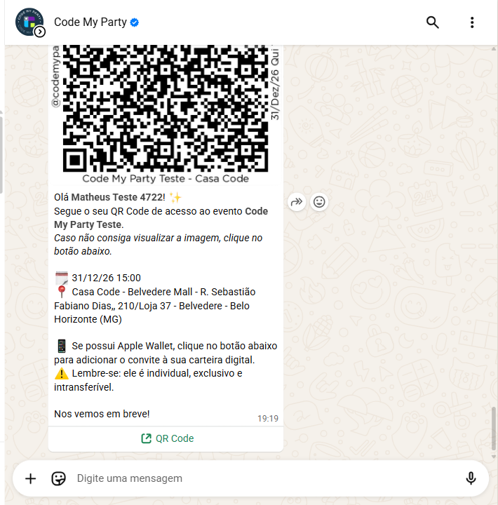
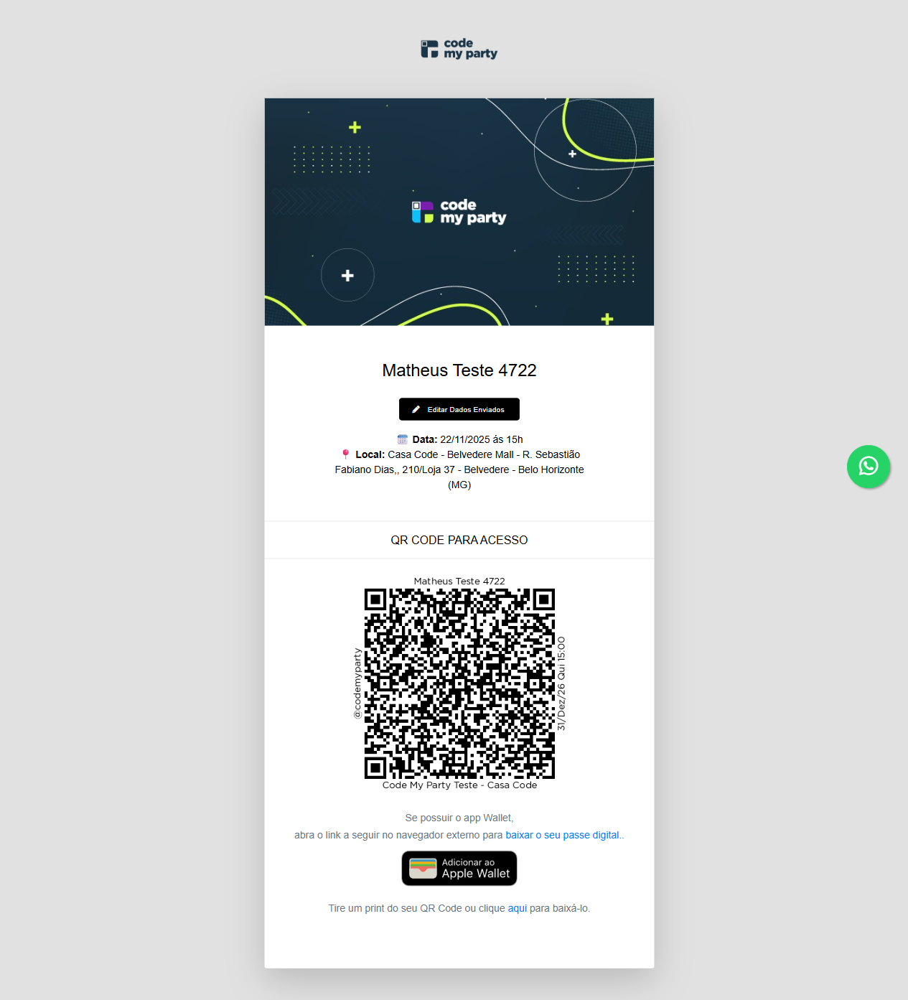
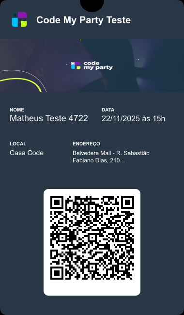

# 🤖 QA Automation Suite | Bot Operacional E2E


> **Bot de QA com geração automática de evidências operacionais.** Automatização ponta a ponta do fluxo de confirmação de convidados em eventos.

---

## 🎯 O Problema de Negócio

Em operações reais de gestão de eventos, a confirmação manual de convidados consome horas de trabalho, é suscetível a falhas humanas e dificulta a auditoria rápida. O processo exige navegação entre o painel administrativo, contato via WhatsApp e validação de documentos, gerando um gargalo operacional.

## 🚀 A Solução

Este projeto é um mini sistema de automação E2E construído com **Playwright**. Ele resolve o problema operacional executando o fluxo completo de forma autônoma e gerando um pacote de evidências visuais (screenshots e Apple Wallet) ao final de cada execução.

**Funcionalidades Principais:**

- **Login administrativo:** Autenticação segura no sistema de gestão.
- **Criação e Aprovação:** Inserção e validação automática de convidados.
- **Integração WhatsApp Web:** Busca de contato, extração de link e captura do QR Code via WhatsApp.
- **Confirmação Dinâmica:** Preenchimento de formulário E2E simulando o usuário final.
- **Geração de Evidências:** Criação de imagens de validação e ingresso Apple Wallet fotorrealista.

---

## 🏗️ Arquitetura do Robô

Abaixo está o fluxo visual da jornada que o robô executa:


### 📂 Estrutura do Projeto

A arquitetura foi desenhada com base no **Page Object Model (POM)** para garantir escalabilidade e fácil manutenção:

- `/pages`: Classes que representam as telas do sistema (Admin, WhatsApp, Confirmação).
- `/tests`: Scripts de execução principal do Playwright.
- `/utils`: Ferramentas auxiliares, manipuladores de imagem (Canvas/Zip) e Logger profissional.
- `/evidence`: Diretório destino para o pacote de evidências gerado automaticamente.
- `/config`: Centralização de variáveis de ambiente seguras.

---

## ⚙️ Como Executar (Localmente)

**1. Clone o repositório e instale as dependências:**
```bash
npm install
```
2. Configure o ambiente:
   Crie um arquivo .env na raiz do projeto contendo suas credenciais (use o .env.example como base):

- ADMIN_USER=seu_usuario
- ADMIN_PASSWORD=sua_senha
- EVENT_ID=1234
- WHATSAPP_CONTACT=Nome do Contato
- GUEST_EMAIL=email@teste.com
- GUEST_PHONE=11999999999

3. Rode a automação E2E:
```bash
npx playwright test
```
## 📸 Galeria de Evidências

Aqui estão exemplos reais dos relatórios e prints gerados automaticamente pelo bot durante a operação:

<p align="center">
  
  
</p>

<p align="center">
  
  
</p>

<p align="center">
  
  
</p>

---

## 🔮 Melhorias Futuras

- Implementação de relatórios nativos em HTML do Playwright.
- Refatoração completa para TypeScript.
- Integração com pipeline de CI/CD (GitHub Actions).
- Containerização com Docker.
